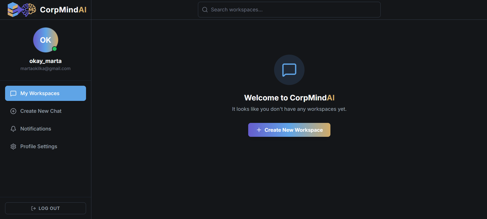
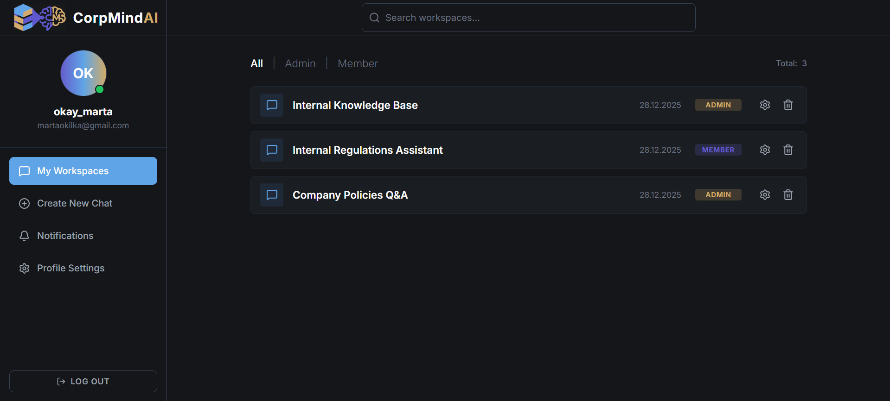
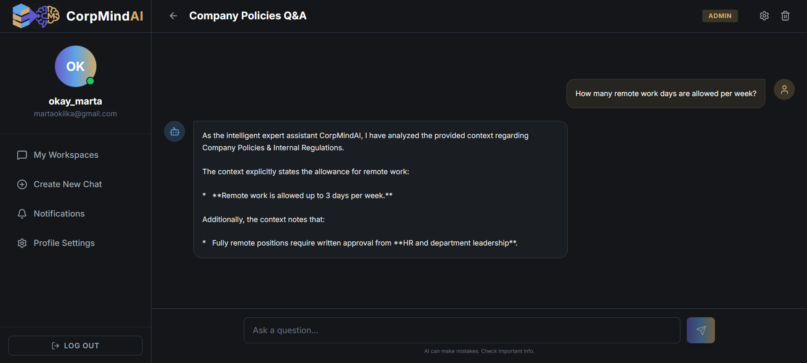
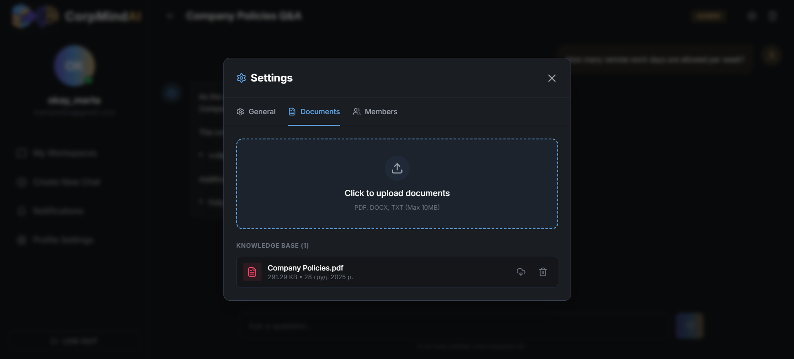

# CorpMindAI 🧠

**CorpMindAI** is a secure, intelligent corporate knowledge base that allows teams to chat with their documents. By leveraging **RAG (Retrieval-Augmented Generation)** technology, it provides accurate, context-aware answers based on uploaded internal files (PDF, DOCX, TXT) without hallucinating.

Built with the **PERN stack** (PostgreSQL, Express, React, Node.js) and **Vector Search**, fully containerized with **Docker**.

---

## 📸 Interface Screenshots

### 1. Dashboard & Workspaces

Manage your projects and see your team status at a glance.





### 2. Intelligent Chat (RAG)

Ask questions about your documents. The AI cites the context it used.


### 3. Document Management

Securely upload and index corporate documents for the knowledge base.


---

## ✨ Key Features

-   **🤖 RAG-Powered Chat:** Uses **Google Gemini 1.5 Flash** combined with **ChromaDB** to answer questions strictly based on your uploaded data.
-   **📂 Multi-Format Support:** Upload and index `.pdf`, `.docx`, and `.txt` files automatically.
-   **🏢 Workspaces & Teams:** Create isolated workspaces and invite team members via email.
-   **🔐 Role-Based Access:** Granular permissions (`Owner` vs `Member`) for workspace management.
-   **⚡ Real-time Vectorization:** Local embedding generation using `@xenova/transformers` (runs on CPU, no external embedding API cost).
-   **🐳 Fully Dockerized:** One command to set up the Frontend, Backend, Database, and Vector DB.

---

## 🛠️ Tech Stack

### Frontend

-   **React 18** (Vite)
-   **TailwindCSS** (Custom Dark/Gold Theme)
-   **Lucide React** (Icons)
-   **Axios** (API Communication)

### Backend

-   **Node.js & Express**
-   **Multer** (File Handling)
-   **Pdf-parse / Mammoth** (Text Extraction)

### Data & AI

-   **PostgreSQL 16** (Users, Chats, Metadata)
-   **ChromaDB** (Vector Database for Embeddings)
-   **Google Gemini API** (LLM for Generation)
-   **Xenova Transformers** (Local Embeddings)

### DevOps

-   **Docker & Docker Compose**
-   **Nginx** (Reverse Proxy for Client)

---

## 🚀 Getting Started

### Prerequisites

-   **Docker** and **Docker Desktop** installed.
-   A **Google Gemini API Key** (Free tier available).

### Installation

1.  **Clone the repository:**

    ```bash
    git clone https://github.com/yourusername/CorpMindAI.git
    cd CorpMindAI
    ```

2.  **Configure Environment Variables:**
    Create a `.env` file in the root directory:

    ```bash
    cp .env.example .env
    ```

    Fill in your details in `.env`:

    ```env
    # Database Configuration
    POSTGRES_USER=postgres
    POSTGRES_PASSWORD=secure_password
    POSTGRES_DB=corpmind_db

    # Security
    JWT_SECRET=random_long_string_for_security

    # AI Service
    GEMINI_API_KEY=your_google_gemini_key

    # Email Service (for invitations)
    EMAIL_USER=your_email@gmail.com
    EMAIL_PASS=your_app_password
    ```

3.  **Run with Docker:**
    Start the entire application suite:

    ```bash
    docker-compose up --build
    ```

4.  **Access the App:**
    Open your browser and navigate to:
    👉 **http://localhost**

---

## 🏗️ Architecture Overview

1.  **Upload:** User uploads a PDF.
2.  **Processing:** Server extracts text and splits it into "chunks" (2000 chars).
3.  **Embedding:** Local AI model converts chunks into numerical vectors.
4.  **Storage:** Vectors are stored in **ChromaDB**, metadata in **PostgreSQL**.
5.  **Chatting:**
    -   User asks a question.
    -   System converts question to vector.
    -   System finds the top 15 most similar text chunks in ChromaDB.
    -   System sends chunks + question to **Google Gemini**.
    -   AI generates an answer based _only_ on those chunks.

---

## 📂 Project Structure

```bash
CorpMindAI/
├── client/                 # React Frontend
├── server/                 # Node.js Backend
│   ├── config/             # DB & AI Configs
│   ├── controllers/        # Request Handlers
│   ├── services/           # Business Logic (Chat, RAG)
│   └── uploads/            # Document Storage
├── docker-compose.yml      # Container Orchestration
├── init.sql                # Database Schema
└── .env                    # Environment Variables
```

---

## 🛡️ License

This project is created for educational purposes.

---
